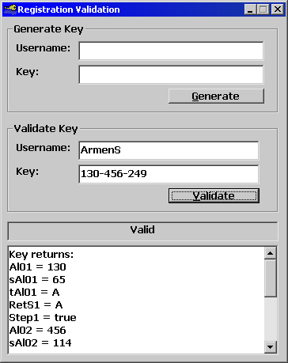



## Registration Key

### Description

A little app that I made to generate a key according to username. Also this app will validate the key. This is a little bit more advanced. Most validation routines actually take the username that is put in, and generates a key for that. Then it will compare that and what the user entered. This leaves a big security hole because anybody with memory editors can actually use the actual program as the keygen. My app actually reverse engineers the key into a username then compares usernames. =) have fun and change it as you like. Also, please vote!
 
### More Info
 

             |
---                |---
**Submitted On**   |2001-05-15 16:30:24
**By**             |[Armen Shimoon](https://github.com/Planet-Source-Code/PSCIndex/blob/master/ByAuthor/armen-shimoon.md)
**Level**          |Intermediate
**User Rating**    |4.7 (14 globes from 3 users)
**Compatibility**  |VB 6\.0
**Category**       |[String Manipulation](https://github.com/Planet-Source-Code/PSCIndex/blob/master/ByCategory/string-manipulation__1-5.md)
**World**          |[Visual Basic](https://github.com/Planet-Source-Code/PSCIndex/blob/master/ByWorld/visual-basic.md)
**Archive File**   |[Registrati196535152001\.zip](https://github.com/Planet-Source-Code/armen-shimoon-registration-key__1-23204/archive/master.zip)

